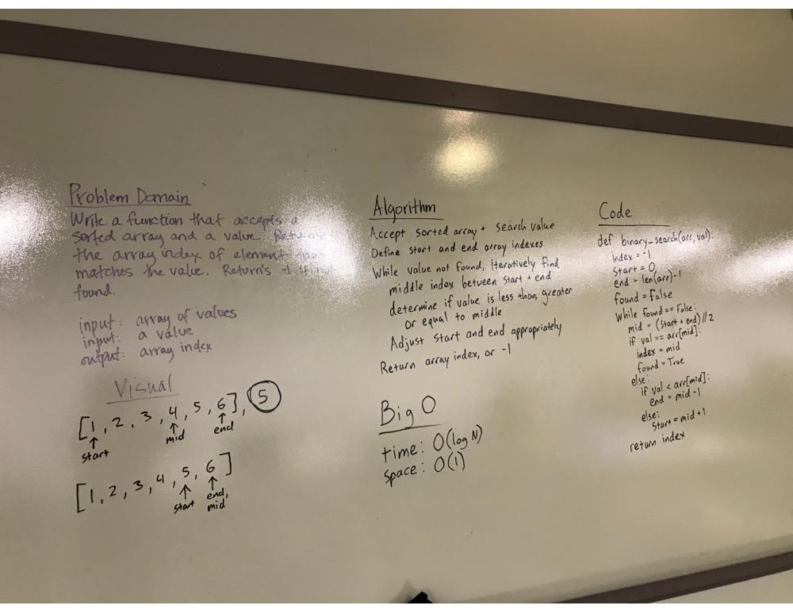

# Binary Search
Code challenge to implement binary search in Python

## Challenge
Write a function that takes in 2 parameters: a sorted array and the search key. Without utilizing any of the built-in methods available to your language, return the index of the array’s element that is equal to the search key, or -1 if the element does not exist.

## Approach and Efficiency
Define start, end, index, found variables; while value is not found, iteratively determine array middle index, check if search value is less than, equal to, or greater than middle value; adjust start and end values appropriately.
time: O(log N)
space: O(1)

## Solution

