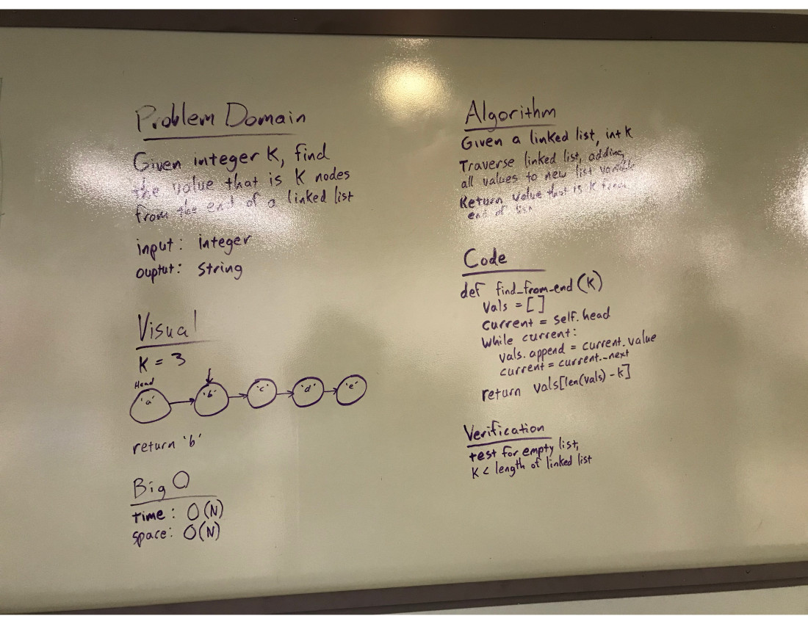

# Singly Linked List
Class that implements a singly linked list

## Challenge
The challenge was to implement a linked list in Python, with methods to add nodes, search node values, and return a collection of all values.

## Approach and Efficiency
The LinkedList class uses the Node class to manage linked list nodes. The insert() method adds a new node at the head position, with an efficiency of O(1). The includes() method iterates through node values, stopping when the value is found or the last node is reached; the efficiency of this method is O(N). The print() method is a simple traversal and concatenation, efficiency O(N)

The append() method adds a new node at the end of the linked list; insert_before() and insert_after() insert nodes before or after the given value. All of these methods have a Big O efficiency of Time: O(N); Space: O(1).

## Solution
