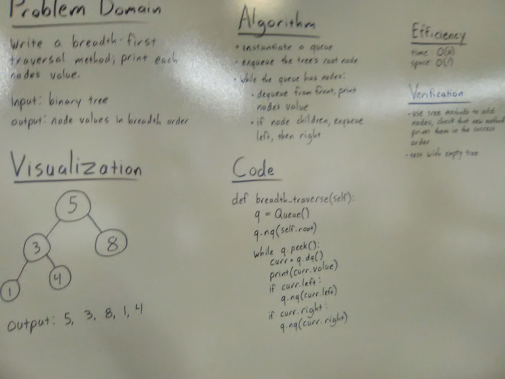

# Breadth-first binary tree traversal

## Challenge
Write a breadth first traversal method which takes a Binary Tree as its unique input. Without utilizing any of the built-in methods available to your language, traverse the input tree using a Breadth-first approach; print every visited node’s value.

## Approach & Efficiency
Used a Queue instance to hold node values while traversing the tree; queue values can then be read off in order. Big O efficiency is time: O(n); space: O(1)

## Solution

