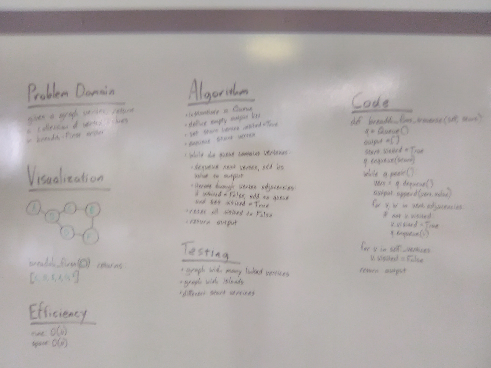

# Graphs

## Challenge
Implement your own Graph, represented internally as a adjacency list

## Approach & Efficiency
Defined classes for Graph and Vertex. Graph has ._vertices attribute, which holds a set of the graph's vertices. Vertex class has value & adjacencies attributes; adjacencies are represented as a tuple of the related vertex object and an edge weight integer.

## API
**add_vertex(value)**
Takes in a value for the new node; adds a new node to the graph; returns the added node

**add_edge(vertex_1, vertex_2, weight)**
Adds a new edge between two vertices in the graph; accepts two vertex objects and a weight integer; both vertexes must already exist in the graph or nothing happens

**get_vertices()**
Returns a set of all of the nodes in the graph

**get_neighbors(vertex)**
Accepts a vertex object as parameter; returns connected vertices as a list of (vertex, weight) tuples

**size()**
Returns the total number of vertices in the graph

**breadth_first_traverse(starting_vertex)**
Returns a list of vertex values in breadth-first order, starting with the starting_vertex

## Breadth-First Solution, 4/8/2019
