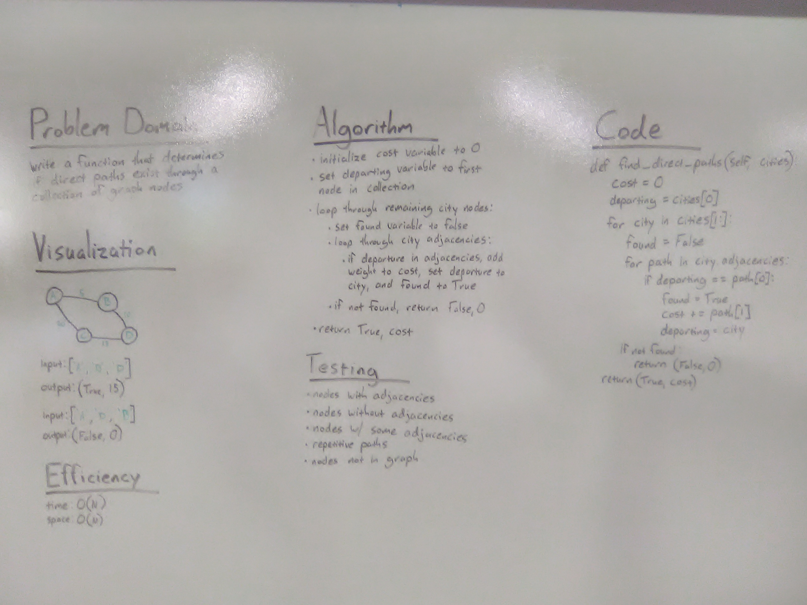

# Graph Direct Paths

## Challenge
Write a function that takes in an array of city names. Without utilizing any of the built-in methods available to your language, return whether the full trip is possible with direct flights, and how much it would cost.

## Approach & Efficiency
Many loops in this one. It is necessary first to turn a collection of city names into a collection of vertex nodes with corresponding values. Then we loop through each city in the list, keeping track of the previous city, and for each city we loop through each adjacency, looking for the previous city. If found, add weight to cost; if not found, return (False, 0) according to the specifications.

It might have been possible to find a more efficient solution, but considering the number of flights in an itinerary is really unlikely to reach into double digits, it didn't seem like a priority.

Big O time: O(N)
Big O space: O(N)

## Solution
