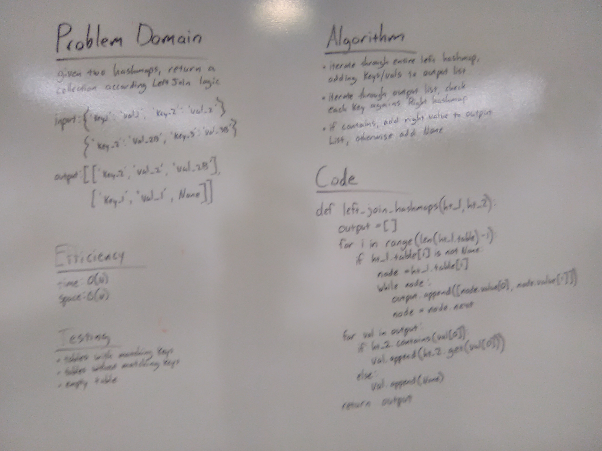

# Implement a simplified LEFT JOIN for 2 Hashmaps

## Challenge
- [x] Write a function that LEFT JOINs two hashmaps into a single data structure.
- [x] The first parameter is a hashmap that has word strings as keys, and a synonym of the key as values.
- [x] The second parameter is a hashmap that has word strings as keys, and antonyms of the key as values.
- [x] Combine the key and corresponding values (if they exist) into a new data structure according to LEFT JOIN logic.

## Approach & Efficiency
We could not think of any way to avoid iterating over the entire left hashmap to get its key-value pairs. BUT, we are spared an O(N^2) efficiency because once we have a list of keys from the left hashmap, we can use the contains() and get() class methods to find/get the values from the right hashmap. This necessitates traversing a linked list within a while loop for each key found.

This approach means we are effectively iterating over the left hash keys twice, and copying all the values into a new array. Definitely efficiency costs to this, but it scales linearly with the input so it's still O(N) time/space.

Efficiency:
time: O(N)
space: O(N)

## Solution

