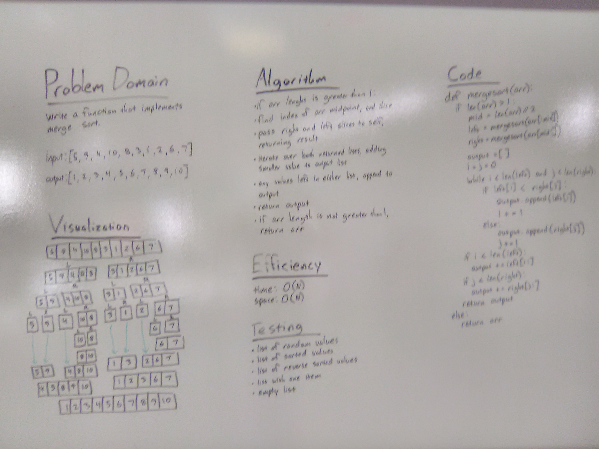

# Merge Sort

## Challenge
Write a function that accepts an array of unsorted integers, and returns a sorted array by a recursive mergesort algorithm.

## Approach & Efficiency
Find the midpoint of the array length; slice left & right halves, pass to self recursively, collecting return values in variables. Then, iterate over both returned lists, adding smaller value to output list. If the traversal is incomplete over either list, add the remainder to the end of the output list. Return output list, or if original array length is 1 return the array.

Time & space efficiency are both O(N). We couldn't figure out a way to merge-sort in place, but I think it is possible. 

## Solution
