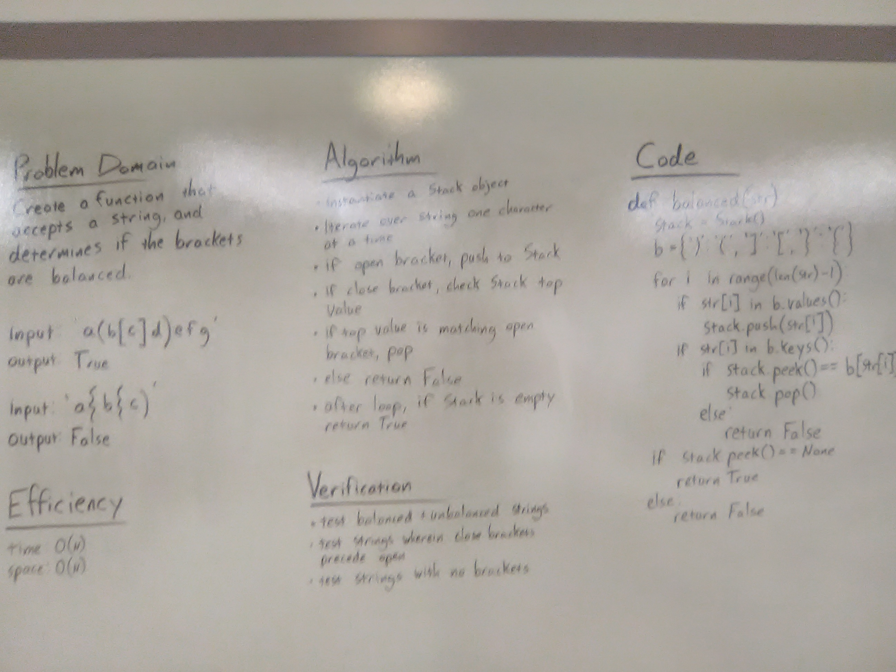

# Multi-bracket Validation.

## Challenge
Your function should take a string as its only argument, and should return a boolean representing whether or not the brackets in the string are balanced. There are 3 types of brackets:

Round Brackets: ()
Square Brackets: []
Curly Brackets: {}

## Approach & Efficiency
Instantiate a Stack; create a dictionary of brackets; iterate through string, adding open brackets to stack and checking close brackets against stack top; pop if brackets match; return True if all brackets match & stack is empty, False otherwise.

Efficiency:
time - O(N)
space - O(N)

## Solution

