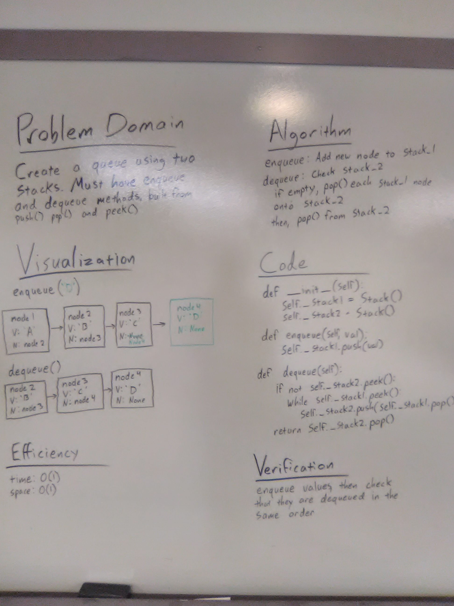

# Implement a Queue using two Stacks

## Challenge
Create a brand new PseudoQueue class. Do not use an existing Queue. Instead, this PseudoQueue class will implement our standard queue interface (the two methods listed below), but will internally only utilize 2 Stack objects. Ensure that you create your class with the following methods:

enqueue(value) which inserts value into the PseudoQueue, using a first-in, first-out approach.

dequeue() which extracts a value from the PseudoQueue, using a first-in, first-out approach.

The Stack instances have only push, pop, and peek methods. You should use your own Stack implementation. Instantiate these Stack objects in your PseudoQueue constructor.

## Approach & Efficiency
enqueue() simply pushes the new value onto stack1.

dequeue() checks if stack2 is empty; if it is, the code removes each node from stack1 and adds it to stack2. Following this, a pop() on stack2 dequeues the "front" node. 

Efficiency on all methods is time: O(1); space O(1)

## Solution

