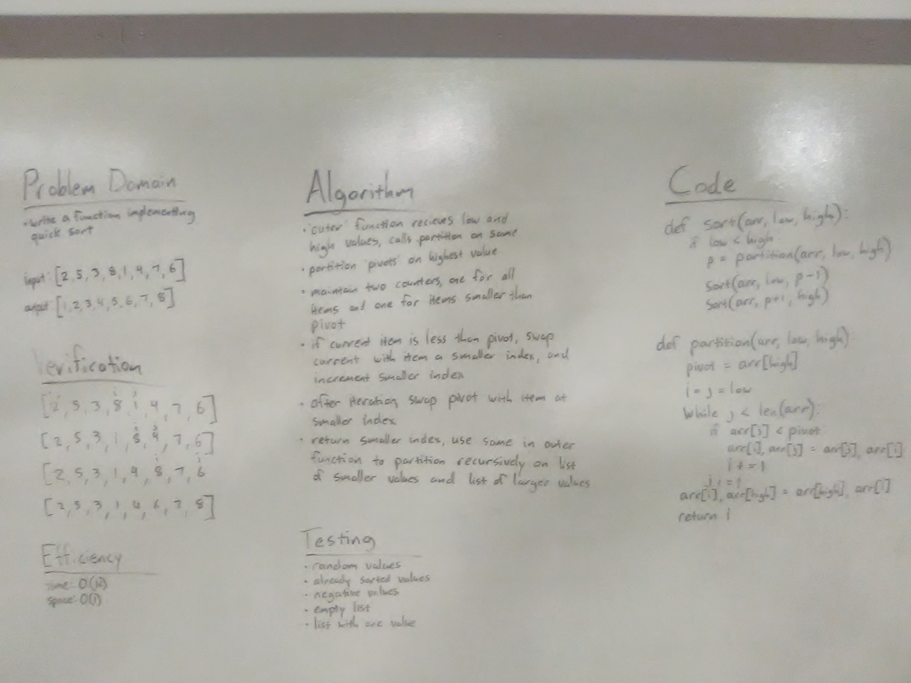

# Quick Sort

## Challenge
Write a function that accepts an array of integers, and returns an array sorted by a recursive quicksort algorithm.

## Approach & Efficiency
._partition method pivots on rightmost element in the section of the array between low and high values; as it iterates through these items, it maintains two counters -- one is the iterators total progress through the items, the other is the index of the rightmost value that is less than the pivot value. Any values smaller than the pivot are swapped to the smaller index, which is then incremented. After all items have been iterated through, the algorithm swaps the pivot value so that it is just to the right of the index of lesser values. 

._partition returns the index of the pivot value, so that ._sort can call itself recursively and run ._partition on the smaller values and the larger values

Space efficiency is O(1), because the array is sorted in place.
Time efficiency is O(N), because the algorithm must iterate over every item in the array

## Solution
