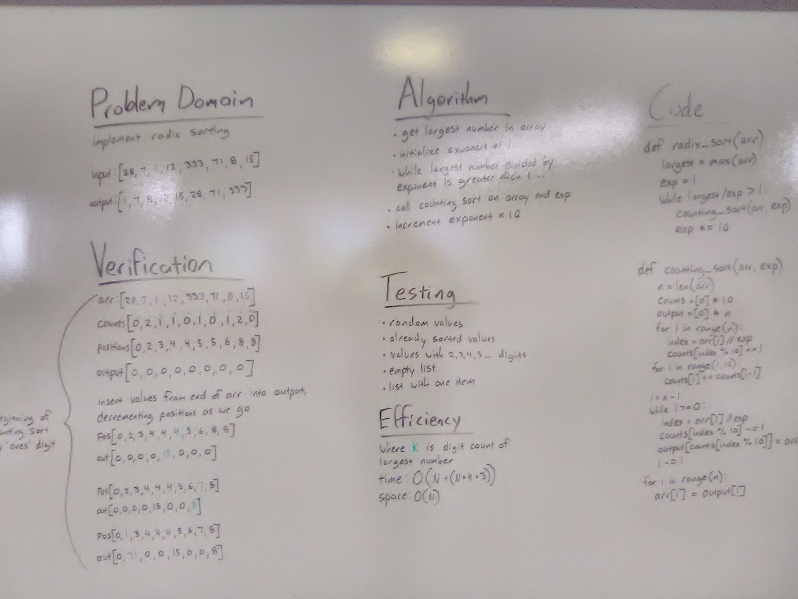

# Radix Sort

## Challenge
Write functions that sort a list of positive integers using a radix sort algorithm

## Approach & Efficiency
Adapted the solution found here (it contained errors): https://www.geeksforgeeks.org/python-program-for-radix-sort/

.counting_sort method creates new lists to hold counts of numbers of nth-place digits (COUNTS), and sorted output values (OUTPUT). We get the digit for a given exponent for each number in the input array (ARR) and increment its count in COUNTS. We loop through COUNTS from left to right and add each value cumulatively to get position indexes. Then we increment ARR from right to left, adding each value to OUTPUT at the positions indicated in COUNTS, decrementing the COUNTS value as we go so that the position information remains accurate if there is more than one number with the specified digit. Finally, a loop overwrites each value of ARR with the corresponding index value in OUTPUT.

The .radix_sort function gets the largest number, and calls .counting_sort with each exponent (1, 10, 100, etc...) until largest_number / exponent is less than or equal to 1.

Space efficiency is O(N + (N * k * 3)), where k is the number of digits in the largest number
Time efficiency is O(N), because we're making a copy of every value in the OUTPUT list

## Solution
