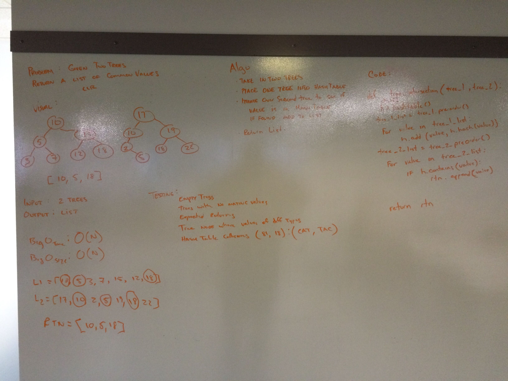

# Find common values in two binary trees

## Challenge
- [x] Write a function that takes two binary tree parameters.
- [x] Without utilizing any of the built-in library methods available to your language, return a set of values found in both trees.

## Approach & Efficiency
The Python "set" datatype would've worked great for this - make a set for the values of each tree, then check the intersection(). Alas, we're discouraged from using built in methods, and encouraged to use our hashtable implementation. 

We used existing traversal methods on the binary trees, returning lists of values. First list is added to the hashtable, second list is checked against that hashtable. We could make this more efficient if we wrote a new class that inherits from BinarySearchTree, and has a method that does the traversal & hashtable stuff in one function. We wouldn't have to pass arrays of values around and iterate through them, but the Big-O efficiency would still be O(N) so it didn't seem like a priority. 

Efficiency:
time: O(N)
space: O(N)

## Solution

